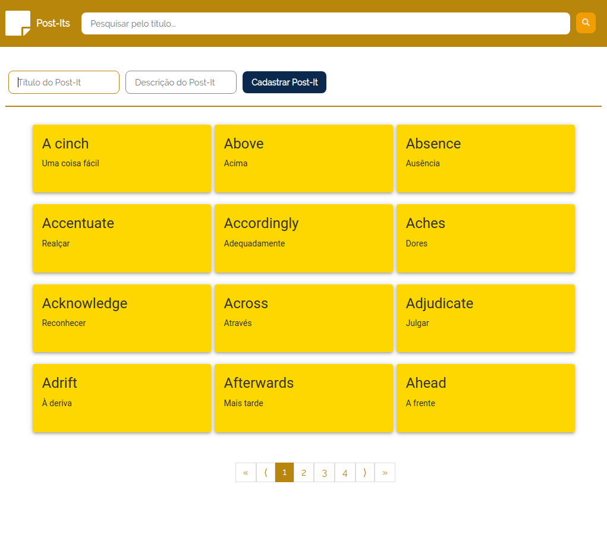

# Post-It Frontend

Projeto para cadastrar, pesquisar ou remover cards que representam Post-Its.



# Instalação e uso

1 - NPM install:

```bash
$ npm i
```

2 - Backend

Configurar o ambiente do backend com o passa a passo [aqui](https://github.com/arielalvesdutra/post-it-backend).

Depois de configurar o backend, é preciso renomear o arquivo `.env-example` para `.env` e apontar o endereço do backend na variavel `REACT_APP_BACKEND_URL`.

3 - NPM start

Com o `npm start`, a aplicação irá abrir no navegador e já poderá ser utilizada.

```bash
$ npm start
```

# Backend

Link [aqui](https://github.com/arielalvesdutra/post-it-backend).

# Principais tecnologias utilizadas

- Axios
- FontAwesome
- Material UI
- React DOM
- Redux


# Atalhos de teclado

`Crtl + e`: foca no input de buscas de post-its pelo título.

`Ctrl + d`: foca no input de título para cadastrar um post-it.
