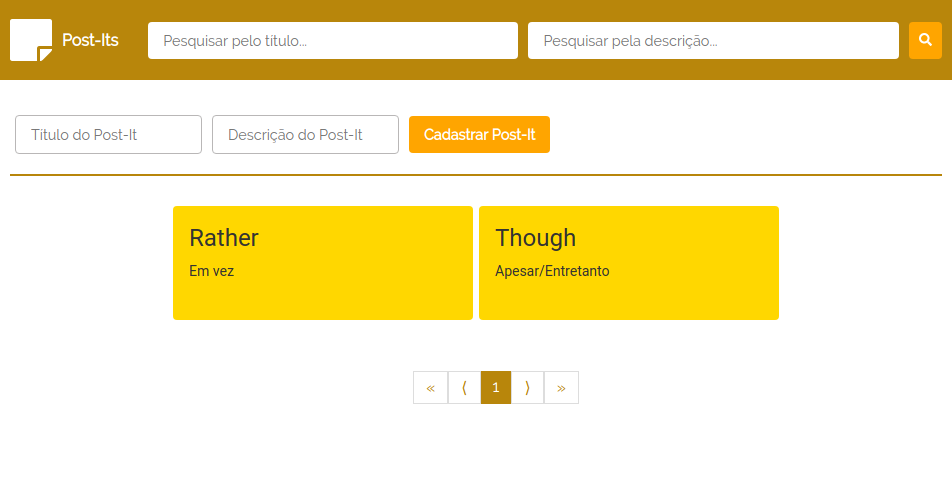

# Post-It Frontend

Project for create, search and remove cards that represents post-its.



# Installation and use

1 - NPM install:

```bash
$ npm i
```

2 - Backend

Set up backend environment with [this](https://github.com/arielalvesdutra/post-it-backend) step-by-step.

After the backend configuration, is necessary rename the `.env-example` file to `.env` and set backend URL in the variable `REACT_APP_BACKEND_URL`.

3 - NPM start

Run `npm start` to start the application.

```bash
$ npm start
```

# Backend

Link [here](https://github.com/arielalvesdutra/post-it-backend).

# Main technologies used

- Axios
- FontAwesome
- Material UI
- React DOM
- Redux

# Keyboard shorcuts

`Crtl + E`: focuses on input for post-its search by title.

`Ctrl + D`: focuses on input for post-its creation.
